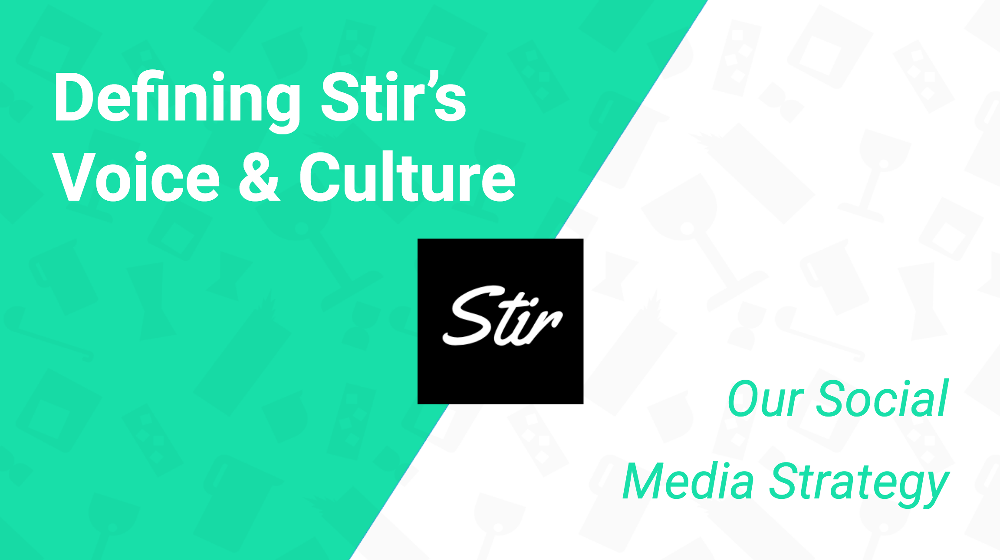
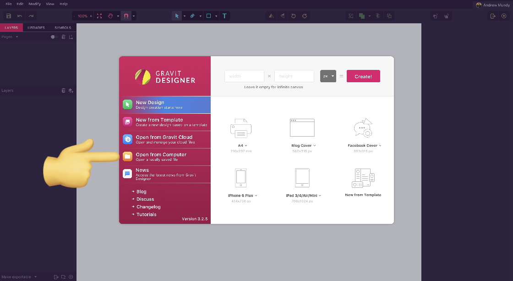
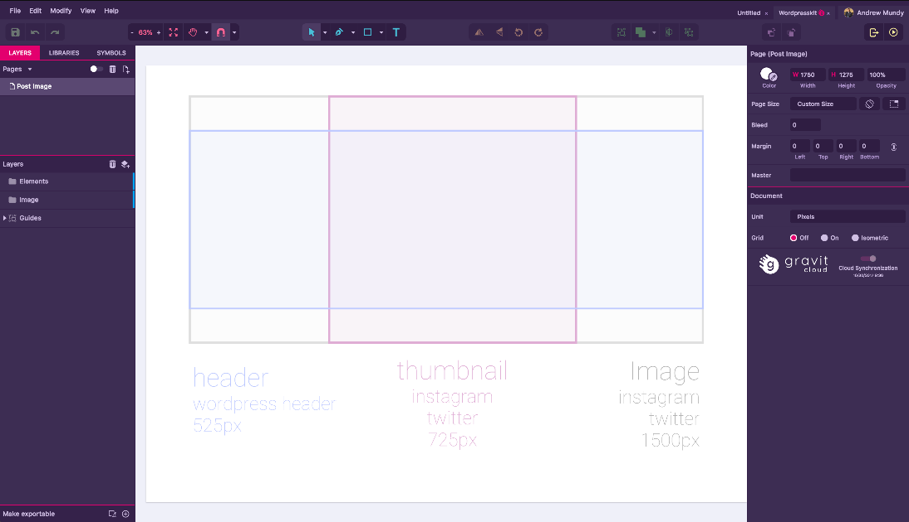
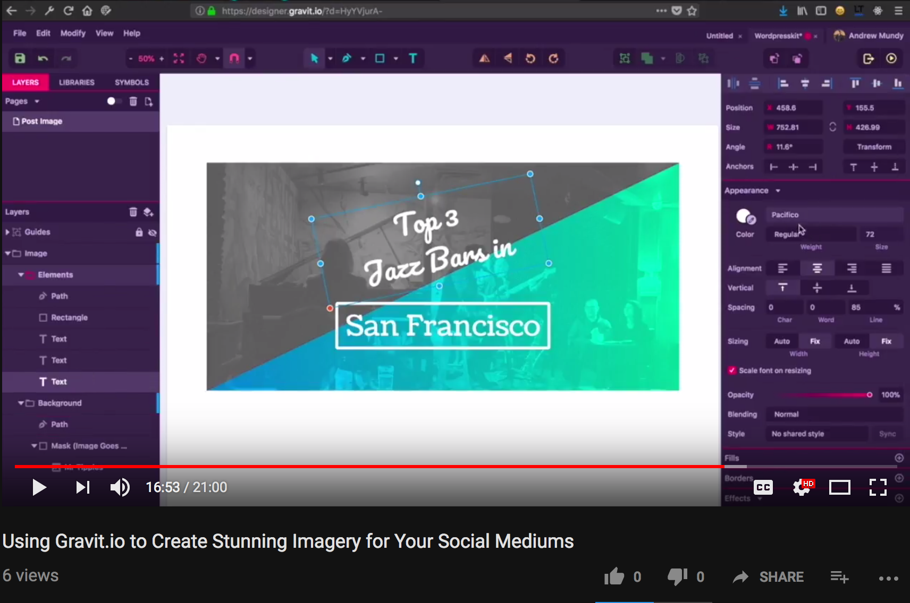

# Welcome to Stir's Wordpress Kit
*Glad to have you with us!* 

Below we will go over the main parts of a social medium post
- Charming & Relevant Verbiage
- High Quality Imagery
- Targeted Hashtags
- Utilizing Specific Platforms

# Charming & Relevant Verbiage!
First of all let’s go over our Voice & Culture slides. Here we talk about the high level concepts of who we are and how we interact.
<a href="https://docs.google.com/presentation/d/1qvyxWn8ITxGT2JAS_HGkw9C47vef-GWki9xQwZFYNsg/edit?usp=sharing"></a>
*if you are unable to open this document then please contact me*

# High Quality Imagery

## What you will need to get started
- Download this directory (click the `green download button` > click `download ZIP` > uncompress the ZIP)
- Sign up for an account on https://designer.gravit.io (free online vector and image editor)

## Lets get your editor setup!
- go to https://designer.gravit.io/
- click `Open from Computer` and select the `wordpresskit.gvdesign` file you downloaded 
- you should see something like this 
- now watch <a href="https://www.youtube.com/watch?v=XsifTSkhsss&t=16s">this</a> tutorial video for an indepth look at the tools and techniques available to you[](https://www.youtube.com/watch?v=XsifTSkhsss&t=16s)

Great! You should have been able to create an image that can be utilized on the many social medium platforms. Let’s go over specifics regarding those posts.

# Targeted Tagging
We touched on tagging in the V&C slides but lets recap here. We will use the following breakdown for a minimum of 16 tags.

- ### 4 Popular / Abstract  (1/4)
`Followback`, `Fun`, `Bar`, `Cocktails`

- ### 4 Niche / Location / Individuals (1/4)
`WhiteChapel`, `DutchNemesis`, `AnthonyParks`

- ### 8 Targeted / Specific (1/2)
`Negroni`, `Gin`, `SanFrancisco`, `SundayFunday`


# Utilizing Specific Platforms
## Wordpress
This is where you will be utilizing your imagery and writing your award winning content! This wordpress post will also be the main content that we will aggregate across the following mediums.

By now we have
- your hand made high quality imagery
- your award winning verbiage following our V&C
- at least 16 targeted tags


With all these elements in our wordpress post lets aggregate them across to the other platforms!

## Instagram
Instagram has become the defacto landing zone for young adults aged 18-28. Thats our target demographic. Instagram utilized high quality imagery, tags, & a large user base that includes many of the bars and venues we touch on in our posts. Our goal is to @ these venues and get them to like and share our content with their huge follower base.

Follow this gif for a breakdown of how to post your image to instagram from chrome. The steps are below.


- while in chrome press `option + cmd + j` to open the developer tools
- click on the `toggle device toolbar` button on the left. Looks like an iPad and iPhone
- in the dropdown menu select `iPhone 6` and refresh `cmd + r` we are basically telling the browser that you want to use their mobile site

Alright, so we have your image set. Lets craft a cool description.
Again, our goal is to be charming, relevant, & creatively get venues to like and share our content. For our "Top 3 Jazz Bars in SF" theme we would write a description similar to

```
@mrtipplessf @comstocksaloon & @clubdeluxesf topped our list of favorite jazz bars in San Francisco! Make sure to check out the daily rotating lunch specials at Comstock. Also, @evamendes, how much jazz have you had to listen to since Ryan was in @lalaland ?

Follow the link in our description for the scoop
```
Cool, we got a post up. Lets add a comment to tie in those hashtags we created for wordpress. If we start the post off with a few periods its creates a comment that a user must click 'read more' to expand. It makes for a cleaner post.

```
.
.
.
.
#mrtipples, #comstocksalloon, #clubdeluxe, #herbyhandcock,
#jazz, #cocktails, #cocktailbar, #jazzbar, #classiccocktails, #pianomood, #saxaphone, #jazzclub, #fall, #instagood, #instamood, #happy
```

## Facebook
facebook doesn't utilize tags in the same relevant way as instagram but the `share` button is our best friend here. If we can get those venues to `share` this post to their users we have an opportunity to be visible to their entire follower base.

so all we need to do for FB is use our
- high quality image
- same description from IG
- retag the venues for facebook (sometimes they are different than their IG handles)
- make sure to link to the specific post we created

something similar to this
```
@mrtipplessf @comstocksaloon & @clubdeluxesf topped our list of favorite jazz bars in San Francisco! Make sure to check out the daily rotating lunch specials at Comstock. Also, @evamendes, how much jazz have you had to listen to since Ryan was in @lalaland ?

get the full scoop at https://stirapp.co/top-3-jazz-bars-sf
```

## Twitter
We have a max character limit of 140 in twitter so we have to be concise in our tweets here. Use tinyurl.com to condense our post link. The `retweet`, `like`, and `comment` actions are our best friends. We want these venues to to do any or all of those to our tweets.

The most important quality of this post is to
- @ as many venues as possible
- have a link to our post
- pack in as many relevant hashtags to max out that 140 limit

Because of the limitations we have to get creative and come up with something like this. Is that an emoji as a hashtag? Yes, yes it is. 😎

```
congrats @MrTipplesSF @ComstockSaloon & @clubdeluxesf for topping our list of jazz bars in sf #jazzbars #sanfran #🥃
http://tinyurl.com/top3jazz
```

# Thanks for reading through all of this!
I know it’s a little long but I wanted a one stop resource reference for all your future posts.

Now that you have all the tools you need let’s get out there and get these followers to fall in love with us!

